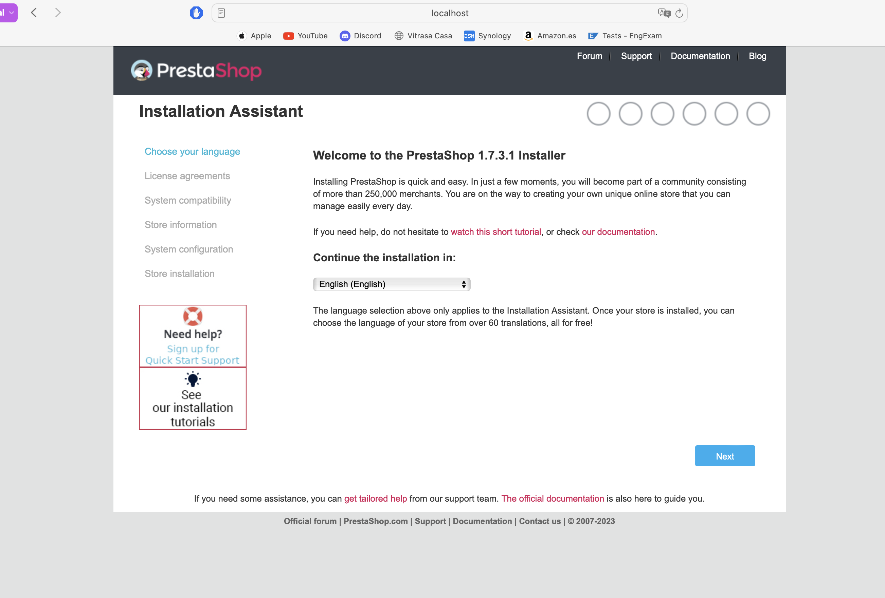
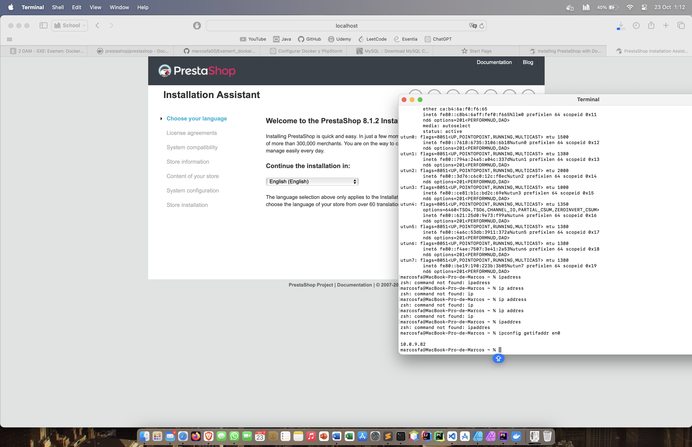
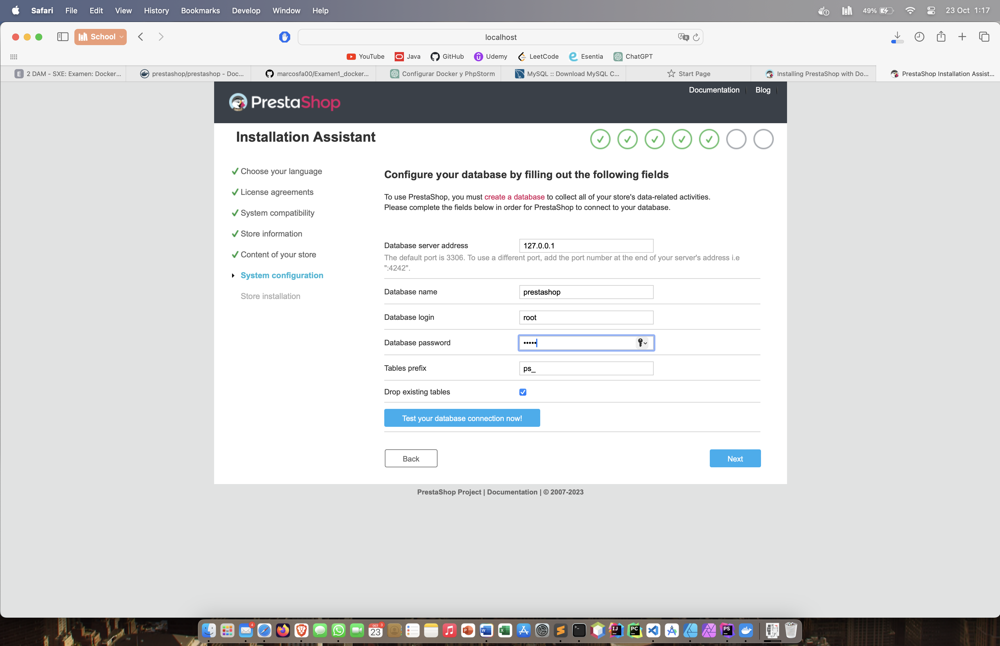

# EXAMEN DOCKER COMPOSE PHPSTORM

## Docker-NORMAL
Comenzaremos creando un archivo tipo **yml** aquí será donde 
guardaremos la configuración de docker compose.

Primero levantaremos la aplicación docker para que esto funcione y depsues utilizaremos un par de comandos para continuar con el ejercicio.

    docker run -ti --name MarcosFA-prestashop -e PS_DEV_MODE=false -e PS_INSTALL_AUTO=0 -p 8080:80 -d prestashop/prestashop:1.7-7.0

bien en el comando anterior estamos creando un nuevo contenedor de docker llamado **examenMarcosFA** esto lo indicamos tras poner **--name**
con el comando **-p** estamos indicando que puertos vamso a usar, en este caso **8080:80** y finalmente indicamos el servicio a levantar **prestashop/prestashop:1.7-7.0**

Bien vamos  configurar la base de datos que vamos a usar, en este caso **MySQL**

    # create a network for containers to communicate
    $ docker network create prestashop-net
    # launch mysql 5.7 container
    $ docker run -ti --name baseMarcosFA-mysql --network prestashop-net -e MYSQL_ROOT_PASSWORD=admin -p 3307:3306 -d mysql:5.7
    # launch prestashop container
    $ docker run -ti --name MarcosFa-prestashop --network prestashop-net -e DB_SERVER=some-mysql -p 8080:80 -d prestashop/prestashop

Tras lanzar el primer comando ya se nos crea un contenedor **MarcosFA-prestashop** en el cual tenemos Prestashop levantado:

# DOCKER COMPOSE CON ARCHIVO YML
Bien hasta ahora suena todo fantástico, pero la readidad es que en los pasos anteriores no estamos usando **DOCKER COMPOSE** or lo que vamos a editar el archivo .YML

podemos copiar y pegar su configuracion desde esta fuente:

https://devdocs.prestashop-project.org/8/basics/installation/environments/docker/

Bien el primer paso será copiar y pegar el codigo de configuracio:

        version: '3'
    services:
    mysql:
    container_name: some-mysql
    image: mysql:5.7
    restart: unless-stopped
    environment:
    MYSQL_ROOT_PASSWORD: admin
    MYSQL_DATABASE: prestashop
    networks:
    - prestashop_network
    prestashop:
    container_name: prestashop
    image: prestashop/prestashop:latest # Latest stable version of the PrestaShop, to see all available images go to ...
    restart: unless-stopped
    depends_on:
      - mysql
      ports:
        - 8080:80
        environment:
        DB_SERVER: some-mysql
        DB_NAME: prestashop
        DB_USER: root
        DB_PASSWD: admin
        networks:
          - prestashop_network
          networks:
          prestashop_network:

TRAS TENER ESTO CONFIGURADO PODEMOS LEVANTAR ESTE SERVICIO CON EL SIGUIENTE COMANDO

        docker compose up

Bien Para mas **INRI CON EL ESTRES DEL EXAMEN** Mac no soporta la version de MySQL que recomienda **Prestashop** puesto que
esa version no admite procesadores **ARM64** para ello he editado el archivo **.YML** substituyendo la siguiete linea:

         image: mysql:8.1

## EUREKA FUNCIONA

Bien a continuación, vamso a continuar con el proceso de intslacion de **PrestaShop**

En una de las partes de la configuración nos pedira que pongamos una contraseña, **evidentemente** esta debe coincidir con la escrita en al archivo **.yml**
por lo que será **admin**

Bueno aquí viene el siguiente ERROR, resulta que la imagen de prestashop lanza un error

     prestashop The requested image's platform (linux/amd64) does not match the detected host platform (linux/arm64/v8) and no specific platform was requested   
Este error indica que la versión utilizada en prestashop no admite procesadores **ARM64** por lo que no funciona, tras intentar solucionarlo 
la pagina deja de funcionar,Tras buscar información sobre esto veo que efectivamente no hay uan versión ARM64 de pestashop

### POSIBLE SOLUCIÓN

He intentado solucionar esto cambiando la imagen de prestashop y añadiendo un volumen, algo que vi en **hithub**

        image: prestashop/flashlight:8.1.0-8.1 # Latest stable version of the PrestaShop, to see all available images go to ...
    volumes:
      - ./init-scripts:/tmp/init-scripts:ro

Pero el servicio sigue sin levantar o se queda pillado en este paso.

## El siguiente paso sería entrar en la cuenta, muy parecido a cómo hicimos con postgres

se debería ver tal que así

